  

[+%C2%B7+Systems+%26+Multimedia+Architect;Author+of+Fairy+Live+%E2%80%94+Zero-Bloat+Pure-Kotlin+RTMP+Engine+(<15MB);Author+of+Fairy+Music+%E2%80%94+Material+120FPS+Audio+Streaming;Low-Level+Android+Media+%C2%B7+MediaCodec+H.264%2FAAC+%C2%B7+Studio+DSP;Kali+Linux+%C2%B7+Low-Level+Protocol+Reverse+Engineering+%26+Optics)](https://git.io/typing-svg)

 

  
  
  
  
  
  

---

> ❝ *Never play it safe.. There is nothing in my heart except cold logic, pure execution, and relentless engineering.* ❞
> 
> — **Benhin** (`@Benhin3025`)

---

### 👨‍💻 About Me

I am **Benhin** ([`@Benhin3025`](https://github.com/lgdark7)), a **Native Android Systems Architect** and **Low-Level Multimedia Engineer** dedicated to building ultra-high-performance mobile systems, zero-bloat audio/video engines, and resilient network protocol architectures.

- ⚡ **Pure-Kotlin Native Multimedia**: Engineering ultra-low latency real-time streaming architectures without third-party bloat. Architect of **[FAIRY LIVE](https://github.com/lgdark7/FairyLive)** (<15MB APK constraint, hardware MediaCodec H.264/AAC encoding, Camera2, MediaProjection, and pure-Kotlin RTMP socket engine).
- 🎵 **High-Fidelity Audio Engines**: Developing modern Android music streaming ecosystems including **[FAIRY MUSIC](https://github.com/lgdark7/FAIRY-MUSIC)** — featuring real-time synchronized "Play Together" host-client playback, 120 FPS buttery-smooth UI, Apple Music Canvas visuals, and multi-source lyrics/metadata integration.
- 🎛️ **Studio Broadcast DSP & Audio Isolation**: Building resilient audio capture pipelines featuring voice-priority DSP, under-speech fan noise subtraction, dynamic sidechain auto-ducking, adaptive noise gates, and dedicated microphone lifecycle guarantees.
- 🛡️ **Kali Linux & Security**: Deep interest in Linux internals, network protocol analysis, packet stream reverse engineering, and low-level system optimization.
- 🔄 **Production OTA & Infrastructure**: Designing decentralized OTA update engines and release distribution pipelines (**[fairylive-releases](https://github.com/lgdark7/fairylive-releases)**) with automated version manifests.

---

### 🛠️ Tech Stack & Arsenal

<table>
  <tr>
    <td align="center" width="96">
      
       <b>Kotlin</b>
    </td>
    <td align="center" width="96">
      
       <b>Android SDK</b>
    </td>
    <td align="center" width="96">
      
       <b>Compose</b>
    </td>
    <td align="center" width="96">
      
       <b>Java</b>
    </td>
    <td align="center" width="96">
      
       <b>C++ / NDK</b>
    </td>
    <td align="center" width="96">
      
       <b>Python</b>
    </td>
  </tr>
  <tr>
    <td align="center" width="96">
      
       <b>Kali / Linux</b>
    </td>
    <td align="center" width="96">
      
       <b>Shell / Bash</b>
    </td>
    <td align="center" width="96">
      
       <b>Git</b>
    </td>
    <td align="center" width="96">
      
       <b>CMake</b>
    </td>
    <td align="center" width="96">
      
       <b>Gradle</b>
    </td>
    <td align="center" width="96">
      
       <b>Material 3</b>
    </td>
  </tr>
</table>

 

**Core Specializations:**  
`Native Android Internals` • `RTMP / FLV Socket Protocol Engineering` • `Hardware MediaCodec (H.264 & AAC)` • `Studio Broadcast DSP & Sidechain Ducking` • `AudioRecord / MediaProjection Pipelines` • `Kali Linux & System Optimization` • `Decentralized OTA Architecture`

---

### 🚀 Highlighted Repositories & Systems

| Project | Description | Core Stack |
| :--- | :--- | :--- |
| **🔴 [FAIRY LIVE](https://github.com/lgdark7/FairyLive)** | Zero-bloat native Android live streaming engine (<15MB APK constraint). Pure-Kotlin RTMP stack, MediaProjection & Camera2, hardware H.264/AAC encoding, and broadcast studio DSP. | `Kotlin`, `MediaCodec`, `RTMP/FLV`, `Audio DSP`, `Camera2` |
| **🎵 [FAIRY MUSIC](https://github.com/lgdark7/FAIRY-MUSIC)** | Material Design Android music streaming app. Features synchronized "Play Together" host/client engine, 120 FPS fluid scroll, Apple Canvas visuals, and multi-source lyrics syncing. | `Kotlin`, `Jetpack Compose`, `Media3/ExoPlayer`, `InnerTube`, `GPL v3` |
| **📦 [fairylive-releases](https://github.com/lgdark7/fairylive-releases)** | Public distribution channel and automated OTA update version manifest pipeline for Fairy Live builds. | `JSON Manifests`, `OTA Engine`, `APK Delivery` |
| **🩺 [Crre-women-health-application](https://github.com/lgdark7/Crre-women-health-application)** | Specialized mobile health monitoring application and telemetry interface. | `Android`, `Kotlin`, `Health Telemetry` |

---

### 📊 GitHub Activity & Real-Time Telemetry

  
  

 

  

---

  <b>“Building the edge between low-level hardware performance and seamless multimedia realities.”</b> 
  <i>Always open to collaborating on high-performance Android systems, real-time protocols, and audio/video pipelines!</i>
    
  
  

